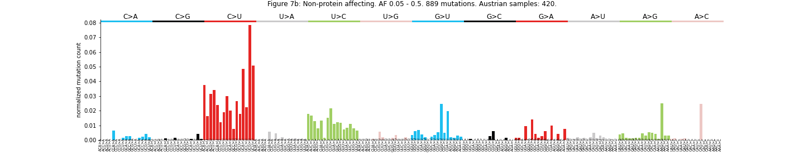
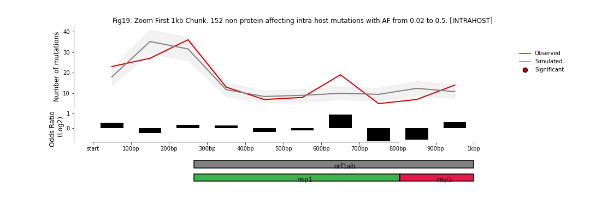

[](https://zenodo.org/badge/latestdoi/313251409)


This repository presents the SARS-CoV-2 genomics analyses conducted by Miguel L. Grau, Francisco Martínez-Jiménez, Oriol Pich and Nuria Lopez-Bigas at the Biomedical Genomics Lab of Barcelona <https://bbglab.irbbarcelona.org/>.   

Most of these analyses are included in the manuscript "Mutational dynamics and transmission properties of SARS-CoV-2 <citation>", please consider citing this manuscript if you want to reference any of these results.   

# Table of contents

1. [Background](#background)
2. [Preprocessing of mutations](#preprocessing-of-mutations)
    1. [Directory tree](#directory-tree)
    2. [Inter-host](#inter-host)
    3. [Intra-host](#inter-host)
3. [Mutational profile](#mutational-profile)
3. [Mutation rate](#mutation-rate)
3. [Mutational Signature Extraction](#mutational-signature-extraction)

## Background  

Our laboratory has ample expertise in the study of mutational processes in cancer. We do not have broad expertise in viral genomics, with the exception of Miguel Grau, who worked previously in the [Disease Ecology and Evolutionary Genetics](http://vjlab.io/) and [WHO Influenza Melbourne](http://www.influenzacentre.org/). However, due to the exceptional situation we have leveraged our knowledge in large-scale cancer genomics to address questions of how mutations accumulate in the SARS-CoV-2 genome across infected human hosts. Most of the techniques and algorithms used have been modified from cancer genomics analysis to study the SARS-CoV-2 mutational patterns.  

All the analyses are based on two types of SARS-CoV-2 datasets: i) the inter-host dataset, which include mutations inferred from the [nexstrain phylogenetic tree](https://nextstrain.org/ncov/global) using the [augur pipeline](https://github.com/nextstrain/augur) to infer nucleotide changes at the internal nodes and ii) the intra-host datasets, including low freq single nucleotide variants detected with the variant calling from Popa et al. manuscript and from the [COVID-19 Genomics UK](https://www.cogconsortium.uk/data/) (COG-UK) – Consortium. Moreover, the COV-UK dataset’s size was powerful enough to be able to perform a mutational signature extraction analysis.

## Preprocessing of mutations 

The first step is extracting the inter-host and intra-host mutations and annotate them according to their consequence type. Once the list is generated, a simulation of the same size is performed. There are Jupyter notebooks available for mutational profile and rate plots.  

The additional analysis using data available from the 'COVID-19 Genomics UK (COG-UK) – Consortium' is available [here](./cov-UK/README.md). 

### Directory tree  

 - ~~JSON files from Nextstrain output are located at `data/json.tar.gz`. There are two files, `SARS-CoV-2-project_NextstrainAustria.json` (including all Austrian + GISAID samples) and `SARS-CoV-2-project_NextstrainAustria_OnlyAustrian.json` (with only Austrian samples).~~ held until publication

 - ~~All the extracted variants are located here: `data/intra/`  `data/inter/`~~ held until publication

- In addition, lists of mutations for illumina (`data/illumina/`) and nanopore sars-cov2 (`data/nanopore/`) and MERS (`data/MERS/`) are available. 


### Inter-host
`inter_extractAnnot.py`: Extract mutations from a Nextstrain tree and annotate them.  
```
$ python inter_extractAnnot.py data/SARS-CoV-2-project_NextstrainAustria.json list.csv data/inter/SARS-CoV-2-project.csv 
```

`inter_simulate.py`: Simulate interhost mutations.  
```
python inter_simulate.py data/inter/SARS-CoV-2-project.csv data/expected/run_interhost_austria_GISAID/1k.csv 1000
```

### Intra-host
`intra_pipeRAW_fromVCF.snk.py`: Filter mutations from VCF files and annotate them.  
```
snakemake --snakefile pipeRAW_fromVCF.snk.py -j 24 --config ifq=data/vcf out=data/intra/
```

`intra_simulate.py`: Simulate intrahost mutations.  
```
python inter_simulate.py data/intra/austrian_allmuta_annot.csv data/expected/run_intrahost_austria_multiVCF/002_05_1k.csv 1000 0.02 0.5
```

Analyses include illumina and nanopore data from GISAID and with MERS data from public repositories as well.

## Mutational profile

[spectra_inter.ipynb](http://nbviewer.jupyter.org/urls/bitbucket.org/bbglab/sars-cov-2-genomics/raw/master/spectra_inter.ipynb)  

Previous reports indicate that both SARS and SARS-CoV-2 have a preference for C>T and A>G mutations (**[DOI: 10.1126/sciadv.abb5813](https://advances.sciencemag.org/content/6/25/eabb5813), [DOI: https://doi.org/10.1101/2020.07.27.223172](https://www.biorxiv.org/content/10.1101/2020.07.27.223172v1), [DOI: https://doi.org/10.1101/2020.06.19.161687](https://www.biorxiv.org/content/10.1101/2020.06.19.161687v3)**). In cancer genomics, it is common to represent the mutation profile as the normalized frequency (i.e., the relative probability of mutation) of the 192 possible tri-nucleotide changes.  

We first generated the mutational profile of inter-host SARS-CoV-2 variants.    

  
  
  
  
  
  

We observed a strong bias towards C>T, G>A, G>U, U>C and A>G mutations, which is independent of their effect on the protein sequence and the source of the samples (i.e, GISAID based versus Austrian origin).      

We next asked whether the sequencing platform (i.e., long reads versus short reads) may have an impact on mutational detection. But we did not detect significant differences in the mutational profile across samples from different technologies (see below).     

  
  
  
  

We also checked whether the mutational profile of SARS-CoV-2 was compatible with other coronavirus, for which enough number of infected human individuals had been sequenced. We only found a substantial number of sequenced samples in the public domain for MERS coronavirus. The comparison shows that the MERS mutational profile recapitulates the mutational biases observed in SARS-CoV-2, suggesting that similar mutational processes may be operating in both viruses.    

  
  

In summary, based on inter-host mutations, we observed a non-homogeneous mutational profile with bias towards C>T, G>A, G>U, U>C and A>G mutations that is independent of the consequence type of the mutations and the source and sequencing platform of the samples. Moreover, this mutational profile is similar to the mutational profile observed across 256 MERS sequenced samples.  
We next questioned whether this mutational profile was consistent across several allelic frequencies. Therefore, we first focused on non-fixed low-allelic frequency intra-host mutations:     

[spectra_intra.ipynb](http://nbviewer.jupyter.org/urls/bitbucket.org/bbglab/sars-cov-2-genomics/raw/master/spectra_intra.ipynb)  

  
  
  
  
  
 

The mutational profiles clearly show consistent tri-nucleotide preferences for allelic frequencies greater than 0.02 and lower than 0.5. However, we did observe an unexpected strong bias towards C>A and G>U at extremely low frequencies (i.e., AF < 0.02).       
Additionally, intra-host mutational profiles are also independent  of the consequence type of the mutations.     

  
  
  
  
  
  
  
  
  
  
  
  
  
 

In summary, both inter-host and intra-host with AF > 0.05 show good agreement in their mutational profiles, dominated by C>T, G>A, G>U, U>C and A>G mutations. These biases are consistent with previous reports that proposed that several RNA editing enzymes such as APOBEC and ADAR may be involved in the generation of this particular mutational profile.  Finally, intra-host variants with AF < 0.02 show strong bias in C>A and G>U transversions, indicating possible artifactual mutations. For this reason the rest of the analyses in the manuscript were done with mutations with AF > 0.02.  

All these analyses have been independently validated with the COG-UK intra-host mutations, supporting the results [herein presented](./cov-UK/README.md).    

## Mutation rate    

[mutrate_genome.ipynb](http://nbviewer.jupyter.org/urls/bitbucket.org/bbglab/sars-cov-2-genomics/raw/master/mutrate_genome.ipynb)   

We aimed to assess whether the variation in the rate of single nucleotide substitution along the SARS-CoV-2 genome can be solely explained by its tri-nucleotide composition. We devised a statistical test performing local estimations of the deviation from the expectation of the observed number of mutations with respect to the expected based on the tri-nucleotide composition of a particular region of the genome. This type of analyses have been applied to detect, for instance, differences in the mutation rate between introns and exons in the human genome ([DOI: 10.1038/ng.399](https://www.nature.com/articles/ng.399)) or the abnormally high accumulation of mutations in transcription factor binding sites in melanoma [DOI: 10.1038/nature17661](https://www.nature.com/articles/nature17661).   
 
The expected distribution of mutations uses the aforementioned SARS-CoV-2 mutational profile, which assigns to each possible mutations a probability based on its trinucleotide context and the nucleotide change, assuming that the localization along SARS-CoV-2 does not have an impact in the mutation rate. The comparison of the observed number of inter-host mutations across 29 chunks of 1kb revealed that the mutation rate of the SARS-CoV-2 follows the expected one along the sequence with the remarkable exception of the last chunk, which shows a significant increase in the number of observed mutations (see below).  

  
  
  

The significant increase in observed mutations is mainly driven from an unexpected number of observed mutations overlapping with the 3’UTR (i.e., 29.7kb and 29.8kb), which suggests that the 3’UTR may be the target of a local hypermutation process. We cannot rule out the possibility that the 3'UTR is under milder selective constraints than the rest of the SARS-CoV-2 genome, and that is negative selection- and the lack of- which is driving this effect.    

We next checked whether the last-chunk increase is also detected when using the intra-host variants from Austrian samples:     

  
  
  
  
  

Reassuringly, we detected an increase of mutations in the last chunk (albeit with lower effect sizes) suggesting that this effect may be independent of the capacity of mutations to be fixed in the population. 

Finally, we checked whether the sequencing platform and/or the length of reads may have an impact on this observation:     

  
  

Indeed, both short-read samples from illumina and long-read samples from nanopore showed similar last chunk increase, probing its independence from the sequencing platform.  

    
In summary, we detected a significant enrichment in mutations in the 3’UTR of the SARS-CoV-2 genome that cannot be explained by its tri-nucleotide composition. This increase is observed across both inter-host and intra-host datasets and its independent of the sequencing platform. Note however that the analysis of the [COG-UK](./cov-UK/README.md) intra-host mutations shows an enrichment in the 5’ UTR and no enrichment in the 3’ UTR. Thus, further analyses are needed to confirm the possible differential mutation rate in UTR.    

## Mutational Signature Extraction  

We performed a set of mutational signature extractions using [SigProfilerJulia](https://bitbucket.org/bbglab/sigprofilerjulia/src/master/) in the '[COVID-19 Genomics UK (COG-UK) – Consortium](https://www.cogconsortium.uk/data/)'. Mutational signatures represent the activity of different mutational processes in the samples, in this case SARS-CoV-2 viruses. For more information regarding the concept of mutational signatures, please refer to [https://doi.org/10.1038/s41586-020-1943-3](https://doi.org/10.1038/s41586-020-1943-3).  

Mutations with a variant allele frequency between 0.01 and 0.5 were selected. Mutations were aggregated in 96 possible subtypes instead of 192 to increase the robustness of the extracion. The extractions were performed using different thresholds of minimum mutations per sample.  

In order to compare the results with mutational signatures deciphered in human cancers (link to https://cancer.sanger.ac.uk/cosmic/signatures), we normalized the resulting signatures by the genomic triplet composition of SARS-CoV-2 and the human whole genome. A cosine similarity analysis - a measurement that allows us to compare two different signatures, 1 being equal and 0 totally different - yields that some of the extracted signatures are virtually equivalent to the APOBEC-related one described in tumors. In the example shown below, one of the signature extracted has a cosine similarity of 0.94 with the APOBEC signature SBS2. It is also tempting to speculate that that the second mutational signature dominated by T>C mutations might be, in fact, caused by the A>G changes induced by ADAR family of deaminases. However, further analysis are needed to confirm this hypothesis.  


{width=25%}

{width=25%}

{width=25%}

{width=25%}
