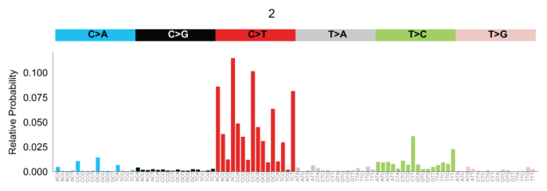
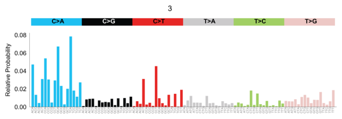

# COV-UK analysis #

The '[COVID-19 Genomics UK (COG-UK) – Consortium](https://www.cogconsortium.uk/data/)' project on NCBI contains more than 20k raw samples (30th July 2020) [Bioproject: PRJEB37886](https://www.ncbi.nlm.nih.gov/bioproject/?term=prjeb37886). We developed a pipeline to extract the low frequency variants, annotate them, and create the files required to perform a multiple analysis (spectra, expected mutation rate, signatures, etc).

Input files required include the raw fastq files, the VEP annotations, the homoplasy_mask and the conda environment yml file (everything included in the `src/` folder).

Output files are basically the vcf files and a tab delimited file which includes the annotation, AF, REF/ALT per each position for all the samples.

## About the input raw data ##

Raw data is publicy available on NCBI. In order to download, there is a command available:

```
cat src/list_30july.txt | parallel -j 8 wget --no-clobber -c
```

Where `src/list_30july.txt` contains a list of ftp adresses of fastq files obtained from the 
 [European Nucleotide Archive’s Sequence Read Archive](https://www.ebi.ac.uk/ena/browser/view/PRJEB37886). Fastq files include illumina and nanopore technologies.  Metadata available at `src/filereport_read_run_PRJEB37886_tsv.tar.xz`

The pipeline results are in the `output/` folder.  

## How to run

There are two pipeline options, for paired and single reads:     
Paired: `snakemake --snakefile pipeRAW_notemp.snk.py -j 48 --config ifq=/workspace/datasets/sars_cov_2/cov-UK/raw/paired/ fa=ref/NC_045512.fasta out=out/paired/ -np`    
Single: `snakemake --snakefile pipeRAW_notemp_SINGLE.snk.py -j 48 --config ifq=/workspace/datasets/sars_cov_2/cov-UK/raw/single/ fa=ref/NC_045512.fasta out=out/single/ -np`    

## Analysis ##

Once the snakemake pipe finishes, there are scripts and notebooks available to perform the analysis (`src_analysis/`):  

1. Spectra. Include notebook: [spectra_intra.ipynb](http://nbviewer.jupyter.org/urls/bitbucket.org/bbglab/sars-cov-2-genomics/raw/master/cov-UK/src_analysis/spectra_intra.ipynb)  
  
  
  
  
  
  
  
  
  
  
  
  
  
  
  
  
  
  
  
  
  

2. Expected mutation rate. Include python script for simulations:  `mutrate_simulate.py` and [mutrate_genome.ipynb](http://nbviewer.jupyter.org/urls/bitbucket.org/bbglab/sars-cov-2-genomics/raw/master/cov-UK/src_analysis/mutrate_simulate.py)  


3. Signatures. Include notebook to create the matrix: [sigProfiler.ipynb](http://nbviewer.jupyter.org/urls/bitbucket.org/bbglab/sars-cov-2-genomics/raw/master/cov-UK/src_analysis/sigProfiler.ipynb). Once the matrix is generated, mutational signatures are extracted using [SigProfilerJulia](https://bitbucket.org/bbglab/sigprofilerjulia/src/master/)  

We performed a set of mutational signature extractions using [SigProfilerJulia](https://bitbucket.org/bbglab/sigprofilerjulia/src/master/) in the '[COVID-19 Genomics UK (COG-UK) – Consortium](https://www.cogconsortium.uk/data/)'. Mutational signatures represent the activity of different mutational processes in the samples, in this case SARS-CoV-2 viruses. For more information regarding the concept of mutational signatures, please refer to [https://doi.org/10.1038/s41586-020-1943-3](https://doi.org/10.1038/s41586-020-1943-3).  

Mutations with a variant allele frequency between 0.01 and 0.5 were selected. Mutations were aggregated in 96 possible subtypes instead of 192 to increase the robustness of the extracion. The extractions were performed using different thresholds of minimum mutations per sample.  

In order to compare the results with mutational signatures deciphered in human cancers (link to https://cancer.sanger.ac.uk/cosmic/signatures), we normalized the resulting signatures by the genomic triplet composition of SARS-CoV-2 and the human whole genome. A cosine similarity analysis - a measurement that allows us to compare two different signatures, 1 being equal and 0 totally different - yields that some of the extracted signatures are virtually equivalent to the APOBEC-related one described in tumors. In the example shown below, one of the signature extracted has a cosine similarity of 0.94 with the APOBEC signature SBS2. It is also tempting to speculate that that the second mutational signature dominated by T>C mutations might be, in fact, caused by the A>G changes induced by ADAR family of deaminases. However, further analysis are needed to confirm this hypothesis.  


{width=25%}  

    
    
   

The exposures of each of the mutational signatures in the COVID samples are depicted below. Briefly, 0 means the signature does not contribute at all to the mutational landscape of the virus, whereas 1 represents all mutations can be attributed to this process.  

   
